<div align="center">

# 🌱 Happify-Frontend — Web Client

### *Detect Early. Support Meaningfully. Grow for Life.*

[](https://react.dev/)
[](https://www.typescriptlang.org/)
[](https://vitejs.dev/)
[](https://tailwindcss.com/)
[](https://firebase.google.com/)
[](https://developer.mozilla.org/en-US/docs/Web/API/WebSocket)
[](../LICENSE)
[](https://garudahacks.com/)

<br/>

**The web client of Happify — an AI-powered mental wellness platform that helps people track their mood, journal safely with AI-assisted reflection, connect anonymously with a caring community, and reach real professional support when it matters most.**

[🌐 Frontend](https://github.com/Happiffy/Happify-FE) · [☁️ Backend](https://github.com/Happiffy/Happify-BE) · [🧠 AI](https://github.com/Happiffy/Happify-AI) · [📱 Mobile](https://github.com/Happiffy/Happify-Mobile) · [🔌 IoT](https://github.com/Happiffy/Happify-IOT)

</div>

---

## 📌 Overview

Happify-Frontend is the **primary web surface** of the Happify ecosystem. It's where a person signs up, tells the app what kind of support they're looking for, checks in with their mood, writes a private journal entry that gets an AI-generated reflection, browses an anonymous community feed, and — when it matters — reaches a real, verified psychologist through a live chat.

> **Happify-Frontend's role in the ecosystem:**
> *"The front door — the calm, encouraging surface where every wellbeing signal a user shares gets captured, visualized, and, when it matters, routed to a human."*

The frontend never talks to the AI layer directly. Every request — mood entries, journals, community posts, referrals, chat messages — flows through **Happify Backend**, which handles auth verification, persistence, AI orchestration, and real-time fan-out over WebSockets.

| | |
|---|---|
| **Framework** | React 19 + Vite 8 |
| **Language** | TypeScript ~6.0 |
| **Styling** | Tailwind CSS v4 + a Duolingo-inspired "playful but safe" design system |
| **Auth** | Firebase Authentication (Email/Password + Google) |
| **Realtime** | Native WebSocket for community, care, and chat channels |
| **Charts / Maps** | Recharts (mood trend, risk summary) · MapLibre GL (anonymous heatmap) |

---

## 🌐 Happify Ecosystem

Happify-Frontend is the **user-facing dashboard** of the platform — every wellbeing signal a person shares here flows through the backend, gets enriched by the AI layer, and can surface again on mobile or through the companion IoT device.

| Repository | Role | Link |
|---|---|---|
| 🌐 **Happify-FE** | Web dashboard — mood, journal, community, care *(this repo)* | [Happiffy/Happify-FE](https://github.com/Happiffy/Happify-FE) |
| ☁️ **Happify-BE** | Node.js API, PostgreSQL, Firebase, WebSocket hub, safety workflows | [Happiffy/Happify-BE](https://github.com/Happiffy/Happify-BE) |
| 🧠 **Happify-AI** | FastAPI service — journal reflection, risk detection, voice processing | [Happiffy/Happify-AI](https://github.com/Happiffy/Happify-AI) |
| 📱 **Happify-Mobile** | Flutter app for mood tracking, journaling, and care access on the go | [Happiffy/Happify-Mobile](https://github.com/Happiffy/Happify-Mobile) |
| 🔌 **Happify-IOT** | Optional companion-device integration for opt-in wellbeing support | [Happiffy/Happify-IOT](https://github.com/Happiffy/Happify-IOT) |

**System architecture:**

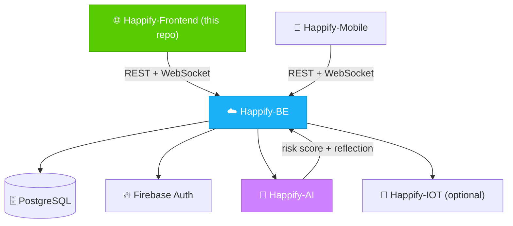

**Principles this frontend is built around:**

- **Privacy by design** — Community posts show an alias, not an identity; the heatmap only ever renders coarse regions built from at least three anonymous contributions.
- **Safety first** — The AI companion supports, it does not diagnose. Referrals and care chat are an explicit, human-reviewed escalation path.
- **Human support matters** — A user can request a professional referral anytime; a verified psychologist can accept it and open a live chat.
- **Accessible by default** — Responsive layouts, with accessibility and tone preferences captured during onboarding.
- **Secure operations** — Firebase ID tokens are attached per request and auto-refreshed; no credentials are ever hard-coded or committed.

---

## ✨ Features

- 🔐 **Authentication** — Firebase email/password and Google sign-in, synced into a Happify backend session via `POST /auth/verify`.
- 🧭 **Guided Onboarding** — A 4-step questionnaire capturing the user's goal, mood triggers, preferred companion tone, and crisis coping preference.
- 📊 **Wellbeing Dashboard** — Totals at a glance, a mood-intensity trend chart, and a journal risk-level breakdown.
- 📓 **Rich-Text Journaling** — A Tiptap editor for daily reflections with optional images and AI-generated reflections/risk levels.
- 🫂 **Anonymous Community** — Alias-based posts, image attachments, support reactions, and threaded replies — all live via WebSocket.
- 🗺️ **Anonymous Mood Heatmap** — A MapLibre GL map of k-anonymous regional mood blocks with a custom date-range filter.
- 🤝 **Referrals & Care Chat** — Users request professional support; psychologists review, accept, and land in a live 1:1 chat.
- 💬 **Real-Time Chat** — Typing indicators, read receipts, presence, optimistic sends, and image attachments over WebSocket.
- 🧑‍⚕️ **Psychologist Role** — A dedicated role with scoped navigation and a certificate/license verification flow.
- 👤 **Profile Management** — Display name and password updates, including linking a password onto a Google-only account.
- 📱 **Responsive, Playful UI** — A warm green/blue gradient, rounded "duo" cards, and Phosphor/Fluent-emoji iconography throughout.

---

## 🛠️ Tech Stack

| Layer | Technology | Purpose |
|---|---|---|
| **Framework** | React 19.2 | Component-driven UI |
| **Build Tool** | Vite 8 + `@vitejs/plugin-react` | Dev server, HMR, chunked production bundling |
| **Language** | TypeScript ~6.0 | Type-safe components, API contracts, hooks |
| **Routing** | React Router 7 | Client-side routing, nested dashboard sections, protected routes |
| **Styling** | Tailwind CSS v4 (`@tailwindcss/vite`) | Utility-first styling, driven from `src/index.css` |
| **Component System** | shadcn/ui (`base-nova` style) | Reusable UI primitives under `@/components/ui` |
| **HTTP Client** | Axios | Typed API calls with auth interceptors |
| **Authentication** | Firebase Authentication | Email/password + Google OAuth, ID-token issuance |
| **Realtime** | Native `WebSocket` API | Community, care, and per-session chat channels |
| **Charts** | Recharts | Mood intensity trend, risk-level donut chart |
| **Maps** | MapLibre GL + `@mapcn` registry | Anonymous heatmap rendering |
| **Rich Text** | Tiptap | Journal and community post editor |
| **Animation** | GSAP 3 (`ScrollTrigger`) | Landing page scroll-triggered reveals |
| **Icons** | Phosphor Icons + Iconify (`fluent-emoji-flat`) | UI icons and colorful emoji-style icons |
| **Testing** | Vitest | Unit tests (e.g. `auth.service.test.ts`) |
| **Linting** | Oxlint + `vite-plugin-checker` | Fast linting and build-time type safety |

---

## 📁 Project Structure

```text
Happify-FE/
├── public/
│   └── mascot-quokka.png        # Happify's quokka mascot
│
├── src/
│   ├── App.tsx                  # Route table + ProtectedRoute (Firebase auth gate)
│   ├── main.tsx                 # React entry point
│   │
│   ├── api/dashboard/           # Typed Axios calls: profile, mood, journal, community,
│   │                             # referral, care chat, heatmap, uploads
│   ├── config/                  # api-client.ts (auth interceptor), firebase.ts
│   ├── constants/                # api.ts (endpoint map), emoji.ts, api-service.ts
│   ├── hooks/dashboard/          # useDashboardData — central data + pagination hook
│   │
│   ├── components/
│   │   ├── ui/                  # Shared primitives (map.tsx, theme.ts, index.tsx)
│   │   ├── dashboard/           # Confirm modals, dashboard panels
│   │   ├── journal-journey/     # Journal entry timeline
│   │   ├── rich-text-editor/    # Tiptap wrapper (getText / getHTML / clear)
│   │   ├── colored-icon/        # Rounded, tinted icon chip
│   │   └── community-heatmap.tsx # MapLibre GL region renderer
│   │
│   ├── pages/
│   │   ├── landing/              # Public marketing page
│   │   ├── auth/                 # Login/Register + auth.service.ts
│   │   ├── onboarding/           # 4-step preference questionnaire
│   │   └── dashboard/            # Main app: overview, records, community, care, chat, profile
│   │
│   ├── types/                    # Shared TypeScript types
│   └── assets/                   # Hero illustration, mascot artwork
│
├── vite.config.ts                # @ alias, Tailwind + checker plugins, dev proxy
├── components.json               # shadcn/ui config
├── .env.example                  # Required environment variables
└── package.json
```

---

## ⚙️ How the App Works

**End-to-end user journey:**

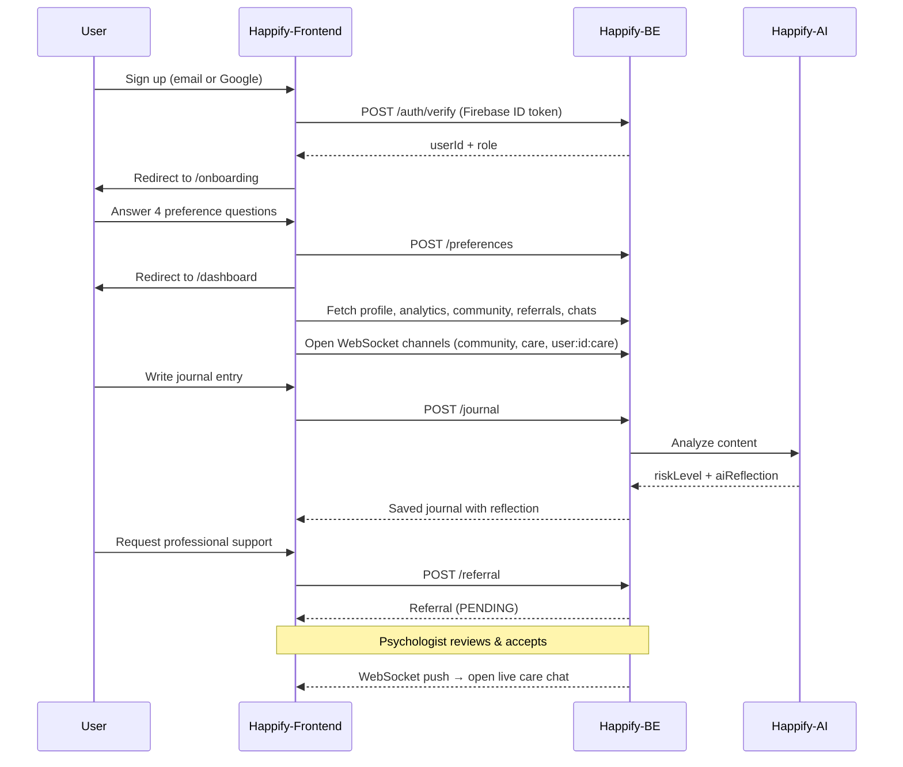

**Authentication & request flow:**

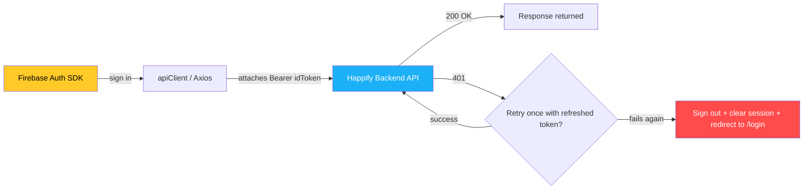

---

## 🎨 Design System

A warm, "playful but safe" visual language (Duolingo-inspired), defined centrally in `src/components/ui/theme.ts`:

| Token | Role | Appearance |
|---|---|---|
| `page` | App background | Soft green/blue radial gradient over near-white |
| `primaryBtn` | Main CTAs | Happify green (`#58CC02`), solid drop shadow, lifts on hover |
| `secondaryBtn` | Secondary actions | Sky blue (`#1CB0F6`) pill buttons |
| `card` | Content containers | Rounded 28px corners, 2px border, flat drop shadow |
| `tones.*` | Status & mood accents | green / blue / gold / red / purple / peach |

**Mood palette** (shared across dashboard, journal risk chart, and the heatmap):

| Mood | Color | Meaning |
|---|---|---|
| `HAPPY` | 🟢 `#58CC02` | Positive check-ins |
| `CALM` | 🔵 `#1CB0F6` | Calm check-ins |
| `NEUTRAL` | 🟡 `#FFC800` | Neutral check-ins |
| `ANXIOUS` | 🟠 `#FF9600` | Elevated-concern check-ins |
| `SAD` | 🟣 `#CE82FF` | Low-mood check-ins |
| `DISTRESSED` | 🔴 `#FF4B4B` | Highest-concern check-ins, CRISIS risk level |

**Iconography:** Phosphor Icons for interface chrome; Fluent flat emoji (via Iconify) for warm, human touches on cards and mood states.

---

## 🔌 API Surface

All requests go through the shared `apiClient` against endpoints in `src/constants/api.ts` (built from `VITE_API_URL`):

| Endpoint | Purpose |
|---|---|
| `POST /auth/verify` | Exchange a Firebase ID token for a Happify session |
| `GET/PATCH /profile` | Read/update the signed-in user's profile |
| `POST /profile/psychologist-applications` | Submit psychologist verification |
| `GET/POST /preferences` | Onboarding preferences |
| `GET /analytics/dashboard` | Totals, mood trend, risk summary, recent journals |
| `POST /mood` | Save a mood check-in |
| `GET/POST /journal` | List/create journal entries (AI reflection + risk level) |
| `GET/POST /community`, `/community/:id/comments`, `/community/:id/support` | Community feed, replies, support reactions |
| `GET /heatmap` | Coarse, k-anonymous mood regions for a date range |
| `POST/GET/PATCH /referral` | Request, list, and review professional referrals |
| `GET /care-chat`, `POST /care-chat/:id/messages`, `PATCH /care-chat/:id` | Live care chat sessions and messages |
| `POST /media/images` | Upload a base64 image, receive a hosted URL |
| `WS /ws?channel=...` | Realtime updates for `community`, `care`, `user:<id>:care`, `care-chat:<sessionId>` |

> The frontend never calls the AI service directly — reflections and risk scoring are computed by **Happify-AI**, orchestrated through **Happify-BE**.

---

## 🗺️ Routes

| Path | Access | Description |
|---|---|---|
| `/` | Public | Landing page |
| `/login` · `/register` | Public | Sign in / create an account |
| `/onboarding` | Public (post-register) | 4-step preference questionnaire |
| `/dashboard` | 🔒 Protected | Overview — stats, trends, heatmap, recent activity |
| `/dashboard/records` | 🔒 Protected | Mood check-ins and journal entries |
| `/dashboard/community` | 🔒 Protected | Anonymous community feed and heatmap |
| `/dashboard/care` | 🔒 Protected | Referral requests / review queue (role-aware) |
| `/dashboard/chat` | 🔒 Protected | Real-time care chat |
| `/dashboard/history` | 🔒 Protected | Closed care chat history |
| `/dashboard/profile` | 🔒 Protected | Profile, password, psychologist application |

`ProtectedRoute` waits for `auth.authStateReady()` before redirecting, avoiding a flash of the wrong screen on refresh.

---

## 🔐 Environment Variables

Create `.env` from `.env.example`:

```env
VITE_API_URL=http://localhost:4000
VITE_FIREBASE_API_KEY=
VITE_FIREBASE_AUTH_DOMAIN=
VITE_FIREBASE_PROJECT_ID=
VITE_FIREBASE_APP_ID=
VITE_FIREBASE_MEASUREMENT_ID=
```

| Variable | Description |
|---|---|
| `VITE_API_URL` | Base URL of the Happify Backend (also used to derive the WebSocket URL) |
| `VITE_FIREBASE_API_KEY` | Firebase Web API key |
| `VITE_FIREBASE_AUTH_DOMAIN` | Firebase authentication domain |
| `VITE_FIREBASE_PROJECT_ID` | Firebase project identifier |
| `VITE_FIREBASE_APP_ID` | Firebase Web application identifier |
| `VITE_FIREBASE_MEASUREMENT_ID` | Firebase Analytics measurement ID (optional) |

> ⚠️ The app throws immediately if `apiKey`, `authDomain`, `projectId`, or `appId` are missing — it will not boot without a valid Firebase configuration.

---

## 🚀 Getting Started

### Prerequisites

- [Node.js 22.x](https://nodejs.org/)
- npm `10.9.4` or later
- A running **Happify Backend** instance reachable at `VITE_API_URL`
- A Firebase Web app with **Email/Password** and **Google** sign-in enabled

### Installation

```bash
git clone https://github.com/Happiffy/Happify-FE.git
cd Happify-FE
npm ci
cp .env.example .env   # then fill in your Firebase project credentials
```

### Development

```bash
npm run dev
```

The app starts at `http://localhost:5173`. Requests to `/api` are proxied to `http://localhost:4000` in development.

### Build & Preview

```bash
npm run build      # tsc -b && vite build
npm run preview     # serve the production build locally
```

### Quality Checks

```bash
npm run lint    # Oxlint
npm test        # Vitest
npm run build   # Type-check + production build
```

---

## 🖼️ App Screens

<div align="center">

| Landing Page | Feature Section |
|:---:|:---:|
| 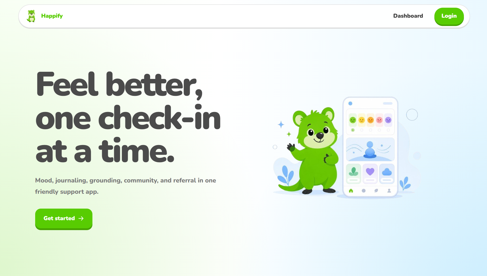 | 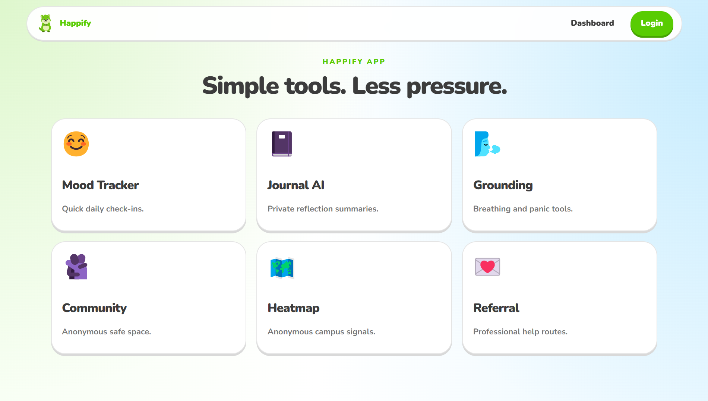 |

| Overview Dashboard | Anonymous Heatmap |
|:---:|:---:|
| 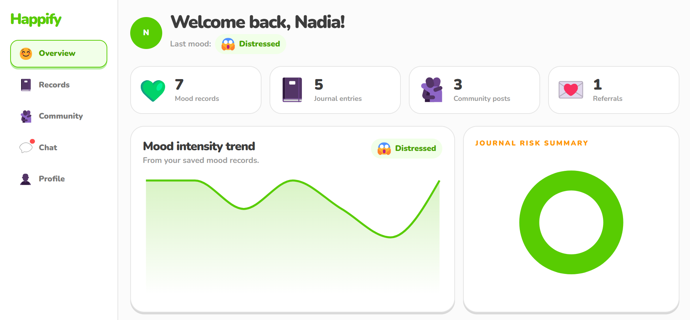 | 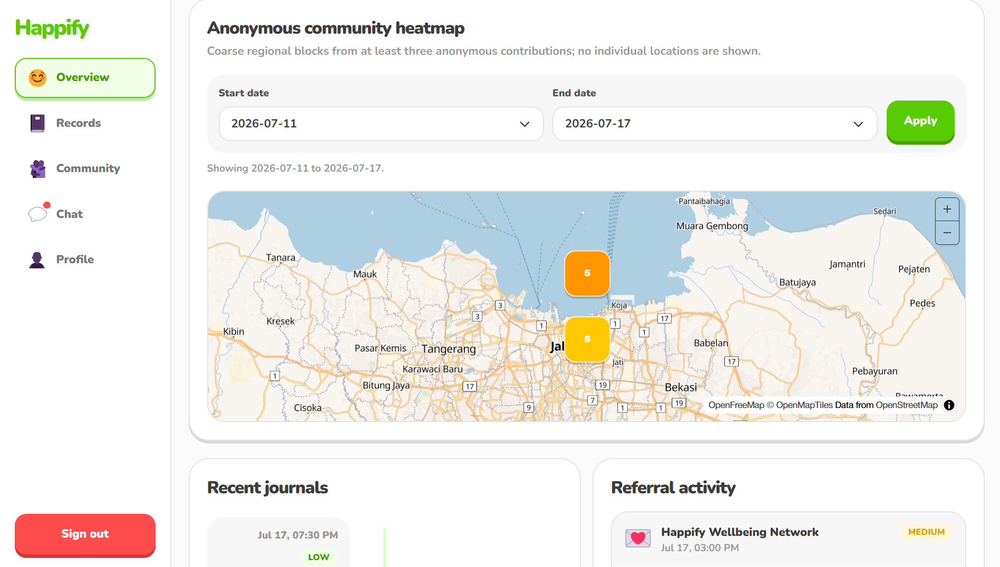 |

| Records Page | Community Page |
|:---:|:---:|
| 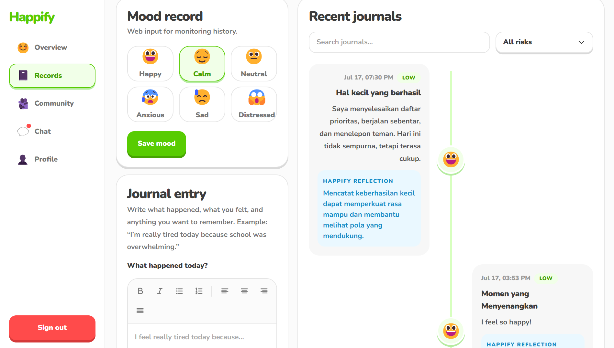 | 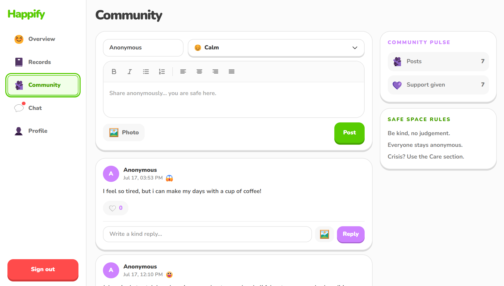 |

| Chat Page | Profile Page |
|:---:|:---:|
| 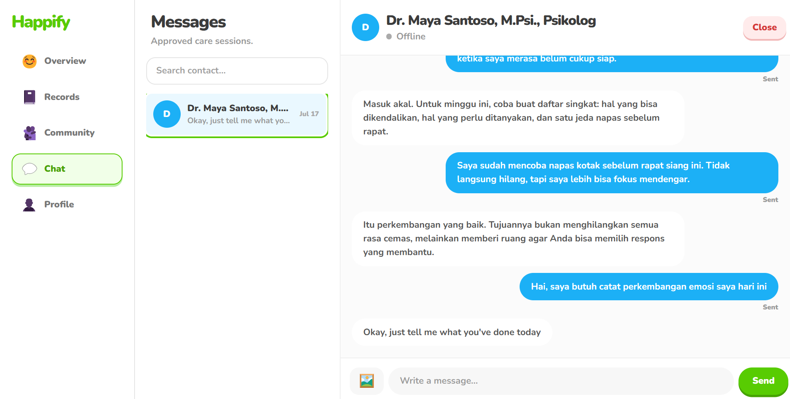 | 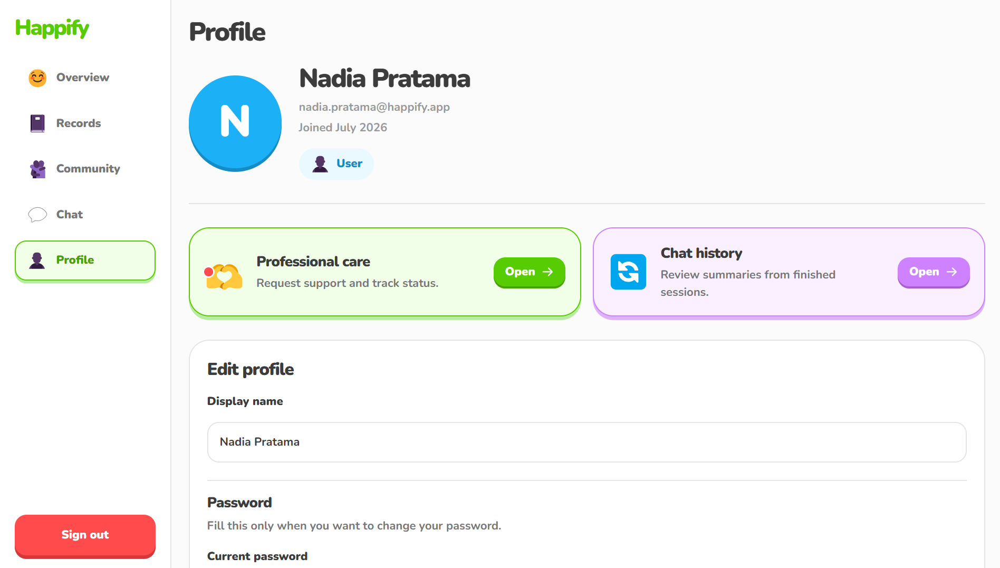 |

</div>

---

## 🎓 Project Context

<div align="center">

Built for

### **Garuda Hacks 7.0 — International Hackathon Competition**

*AI-Powered Mental Wellness Platform*

</div>

Happify-Frontend is the **web dashboard** of **Happify**, a privacy-aware digital wellbeing ecosystem built around early detection, meaningful support, and lifelong emotional growth:

| Layer | Component | Role |
|---|---|---|
| 🌐 **Web** | **Happify-FE** *(this repo)* | Mood tracking, journaling, anonymous community, care workflows |
| ☁️ **Backend** | [Happify-BE](https://github.com/Happiffy/Happify-BE) | API, PostgreSQL, Firebase, WebSocket hub, safety & moderation |
| 🧠 **AI** | [Happify-AI](https://github.com/Happiffy/Happify-AI) | Journal reflection, risk detection, voice processing |
| 📱 **Mobile** | [Happify-Mobile](https://github.com/Happiffy/Happify-Mobile) | Flutter app for on-the-go mood tracking and care access |
| 🔌 **IoT** | [Happify-IOT](https://github.com/Happiffy/Happify-IOT) | Optional companion-device integration |

---

## 👥 Team

<div align="center">

**Outstanding BINUSIAN Team — Garuda Hacks 7.0**

| Name | Role |
|---|---|
| **Andrian Pratama** | Full-stack Developer |
| **Khalisa Amanda Sifa Ghaizani** | IoT Engineer |
| **Michella Arlene Wijaya Radika** | Product Developer |
| **Stanley Nathanael Wijaya** | Product Developer |

</div>

---

## 📄 License

This project is licensed under the **MIT License** — free to use, modify, and distribute.

```
MIT License

Copyright (c) 2026 Happify — Garuda Hacks 7.0

Permission is hereby granted, free of charge, to any person obtaining a copy
of this software and associated documentation files (the "Software"), to deal
in the Software without restriction, including without limitation the rights
to use, copy, modify, merge, publish, distribute, sublicense, and/or sell
copies of the Software.
```

<br/>

*"Detect early. Support meaningfully. Grow for life."*

<br/>

[](https://garudahacks.com/)

<br/>
Made with 🌱 for Garuda Hacks 7.0

</div>
